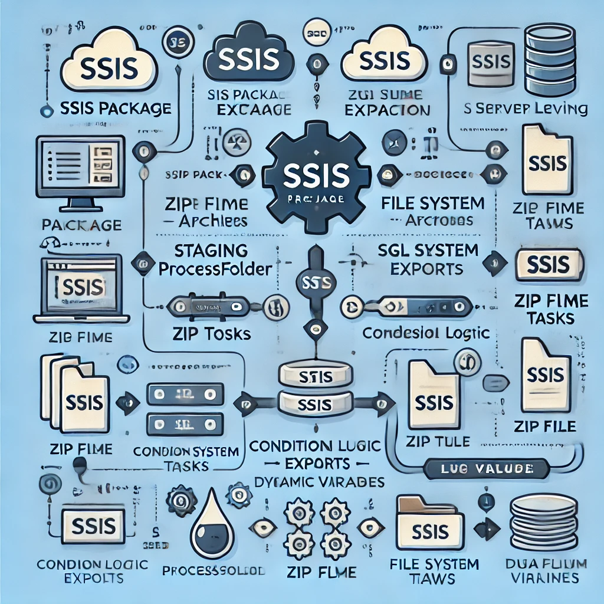

# SSIS ETL Automation Project – ZIP File Processing & SQL Server Integration

## Overview
This project automates an end-to-end ETL process using SQL Server Integration Services (SSIS). It includes folder creation, conditional ZIP extraction, dynamic file processing, SQL Server data loading, log tracking, and error handling across multiple SSIS packages.

## Key Features
- Structured into 3 sub-packages + 1 main package.
- Automated folder creation: `Staging`, `SharingFolder`, `ProcessFolder`, `ArchivedFolder`.
- ZIP file extraction with date validation using script tasks.
- Conditional file processing with foreach loop container.
- SQL Server data loading using Data Flow Tasks.
- Special handling for `employee` + `company` file merging.
- Export log table from SQL Server to CSV file.
- Full logging mechanism for errors, file checks, and process states.

## Technologies Used
- SQL Server Integration Services (SSIS)
- SQL Server
- T-SQL
- CSV file handling

## Project Structure
- `DB.sql`: SQL script for creating necessary database tables.
- `Main.dtsx`: Main SSIS package orchestrating the workflow.
- `Error.csv`: Sample output log file.
- `report.docx`: Detailed process explanation and dataflow descriptions.
- `הוראות הרצה מיוחדות.docx`: Execution order instructions.

## Package Workflow Summary
### 📁 Create Folders Package
- Creates necessary directories.
- Initializes SQL Server tables via SQL Task.

### 🔄 Main Package
- Runs `extract zip package` and `fill SQLServer package` sequentially.
- Exports log table to CSV via Data Flow Task.

### 📦 Extract ZIP Package
- Checks if today's ZIP file exists in `SharingFolder`.
- Extracts and moves files to `ProcessFolder`.
- Updates log table accordingly.

### 🗃 Fill SQLServer Package
- Iterates through files in `ProcessFolder`.
- Validates file name and date.
- Loads matching files into SQL tables.
- Merges `employee` + `company` if both exist.
- Logs skipped/invalid files and moves ZIP to `ArchivedFolder`.

## Execution Instructions
1. Run `Create Folders` package first.
2. Move the ZIP file into the correct folder (`SharingFolder`).
3. Execute the `Main` package.

## Notes
- Parameters used across packages support dynamic folder paths.
- If no ZIP file is found or no valid files exist, log table is updated accordingly.

---
This SSIS project demonstrates dynamic and modular ETL pipeline design for real-world data handling and SQL integration scenarios.

